# Surveying-and-Preserving-the-Digital-Crime-Scene

## Aim:

Data recovery from unallocated space, using forensic tools(Autospy) to extract and analyze data.

## Implementation Steps:
### 1.Copy Files to the Virtual Disk
<ul>Open File Explorer → Go to the new drive (C: or D:), where the folder created in the New Virtual Disk</ul>
<ul>Create a new folder (Autospy) and copy images or files into it.</ul>

### 2.Delete the Files
<ul>Select any one or two images → Press Delete.</ul>
<ul>Empty the Recycle Bin to permanently delete them.</ul>

### 3.Recover Deleted Files Using Autopsy
### Open Autopsy & Create a New Case
<ul>Launch Autopsy and Run as a administrator</ul>
<ul>Click Create New Case.</ul>
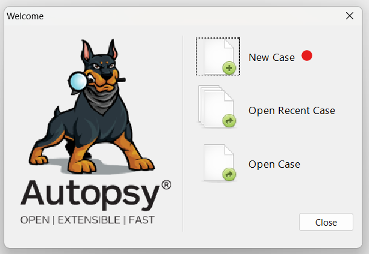

<ul>Enter a Case Name (e.g., Autopsy1).</ul>
<ul>Choose a Case Folder location.</ul>
<ul>Click Next → Click Finish.</ul>
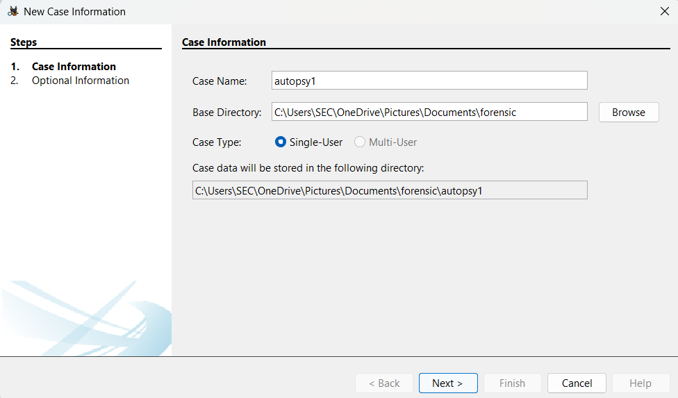

### Add the Virtual Disk as an Evidence Source
<ul>Click Add Data Source → Select Host</ul>
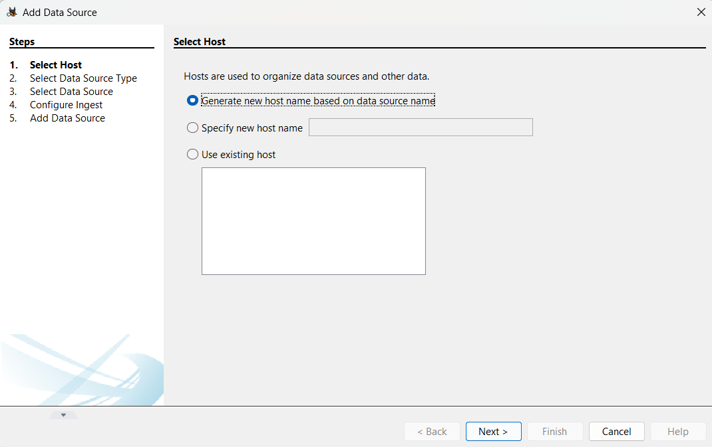

<ul>Select Local Disk → next</ul>
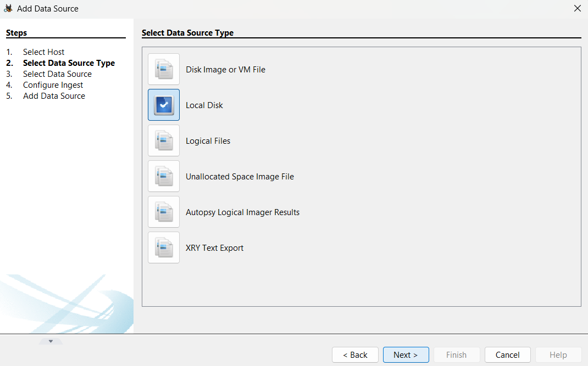

<ul>Select Disk → Choose the VHD drive (Drive1)</ul>
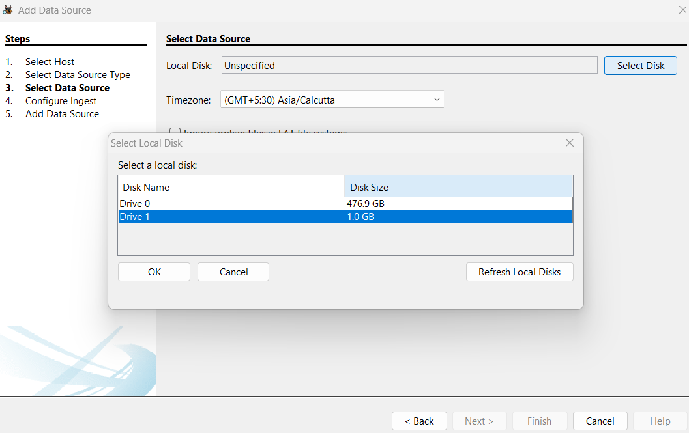

<ul>Click Next → Keep default settings → Click Finish.</ul>
<ul>Wait for Autopsy to process the disk.</ul>

### Recover Deleted Files
<ul>Go to File Views (left panel).</ul>
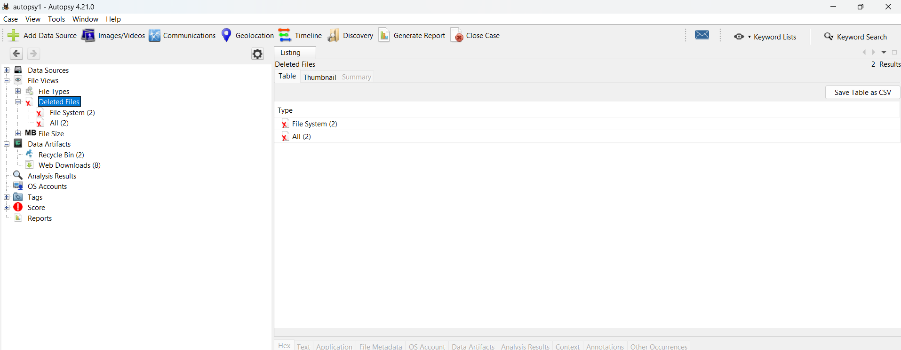
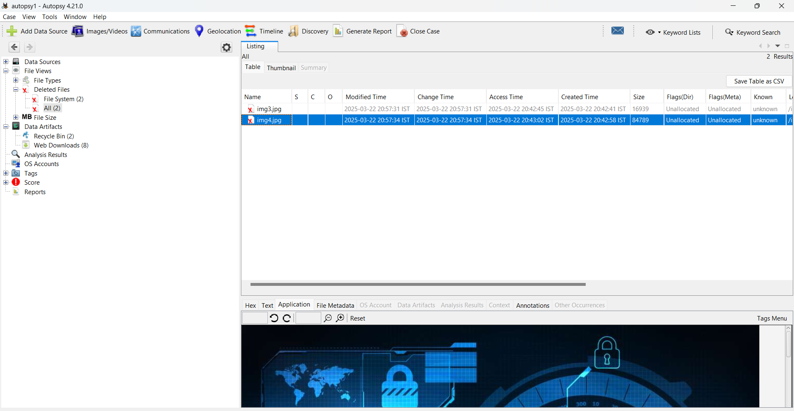

<ul>Click Deleted Files → Find your deleted images.</ul>
<ul>Right-click an image → Click Extract File.</ul>
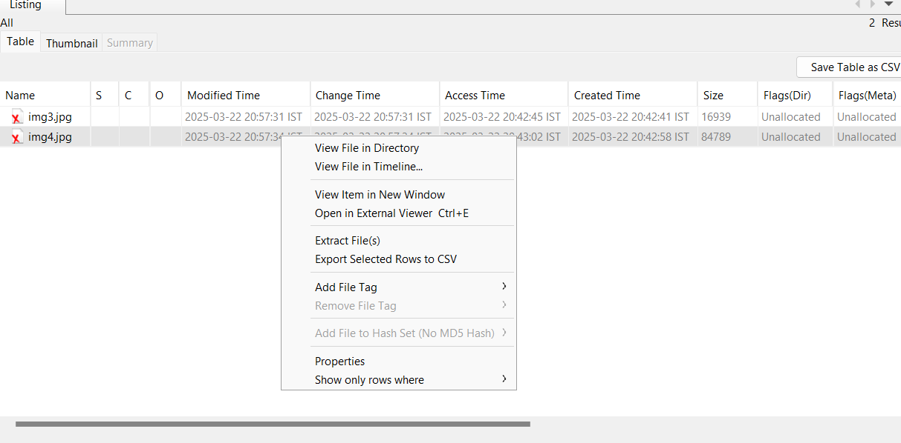

## Output:
### Folder before deleting the files

<ul>Folder after deleting the files</ul>
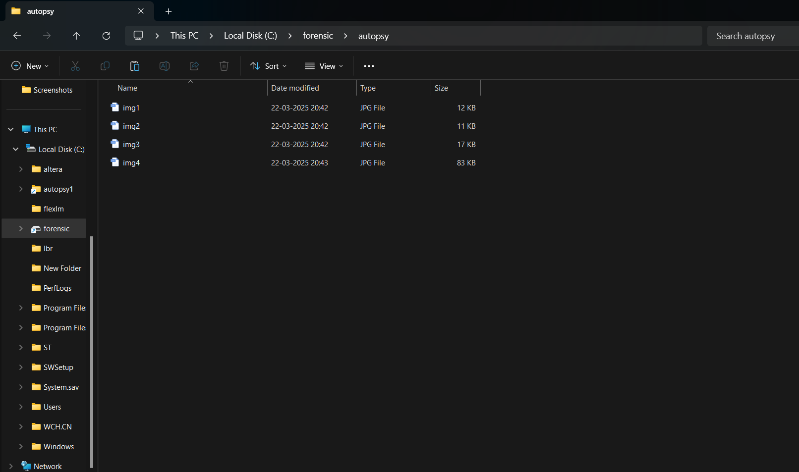
<ul>Folder after deleting the files</ul>
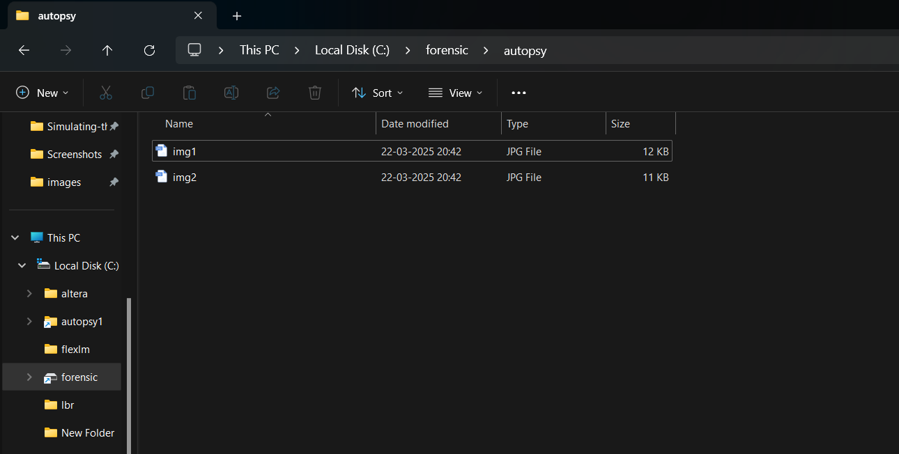

<ul>Folder after extracting the deleted images using autopsy</ul>
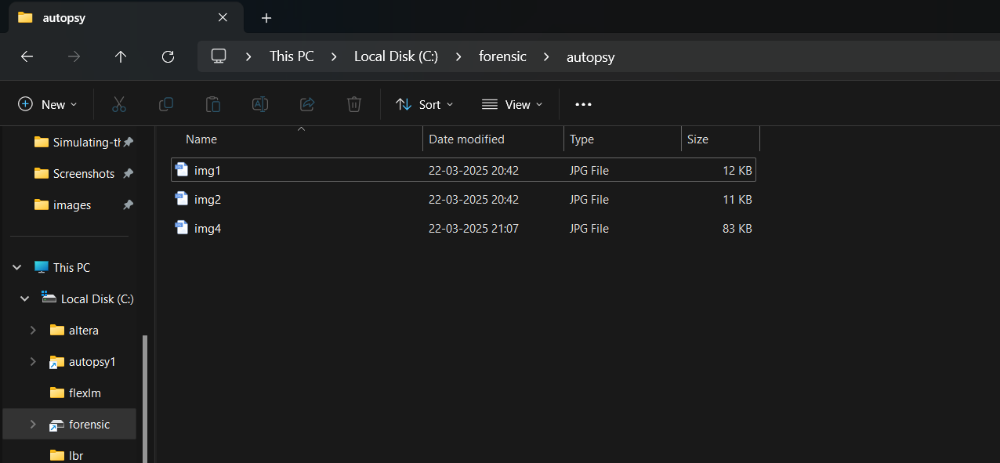

## Result:

Successfully extracted the deleted files from unallocated space using the Autospy tool.
